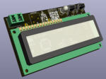
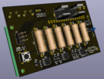
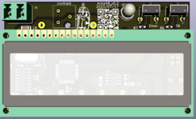
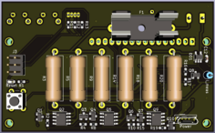

## Mega micro ammeter 48  
The microammeter is designed to measure small direct currents in low-voltage 
circuits and has the following characteristics:  
+ range of measured currents: 0.05 μA - 500 mA in 6 ranges;  
+ automatic range selection;  
+ results on a display 1602;  
+ building a current graph on a PC (connect via micro USB);  
+ potential at the current measurement point: 0 - 6 V;  
+ power: 5V, via connector micro USB.  
   
Устройство построено на основе статьи

---
#### Scheme:  
[Scheme_v0.2](docs/mega_micro_ammeter_48_v0.2.pdf)  

#### PCB:  
   

---
#### Gerber:  
Archive for production:  
[gerber_v0.2](https://github.com/piro-s/mega_micro_ammeter_48/raw/main/gerber/mega_micro_ammeter_48_v0.2.zip)  
